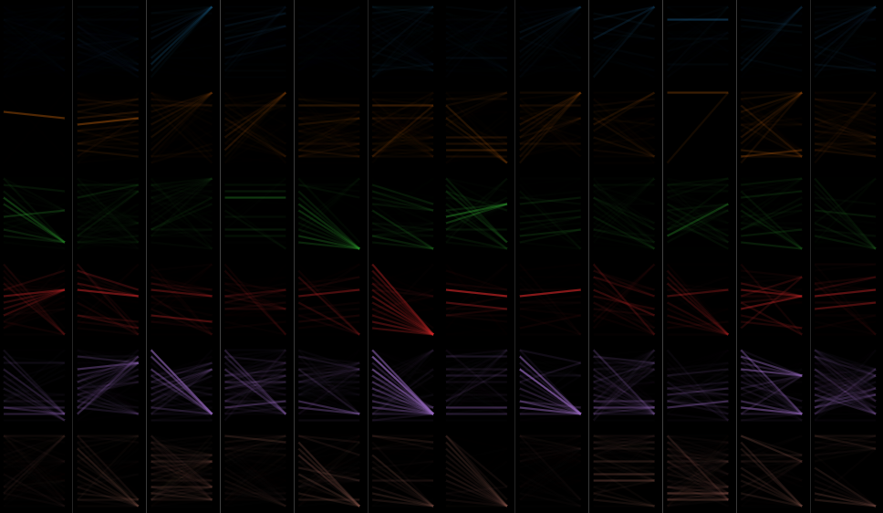
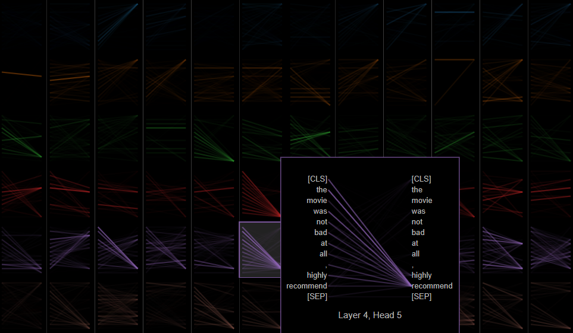
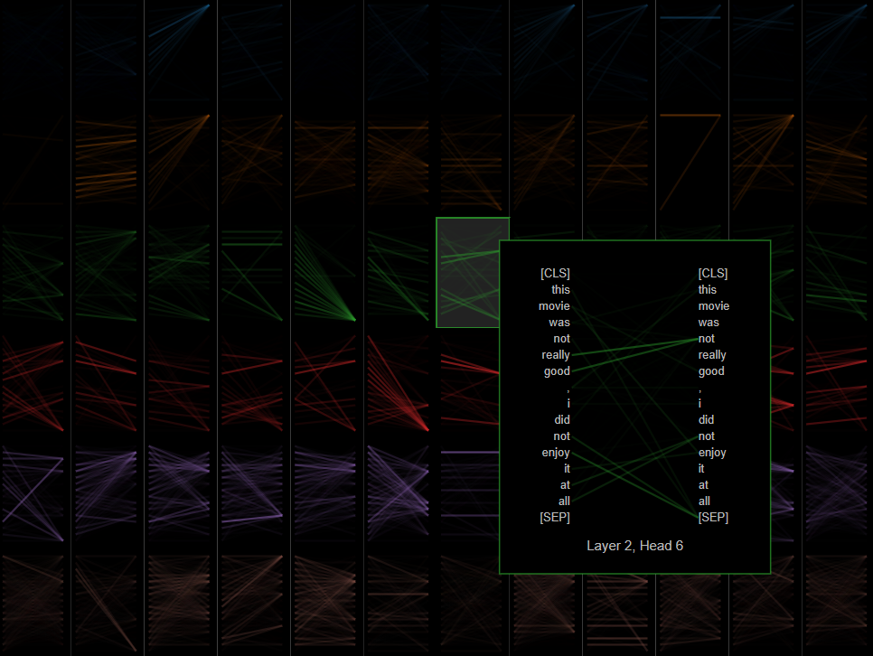
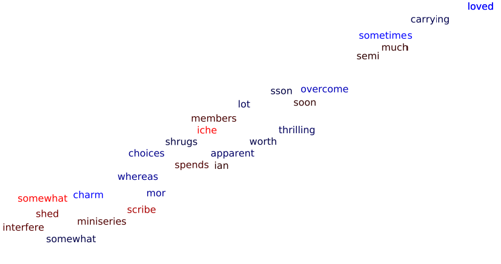
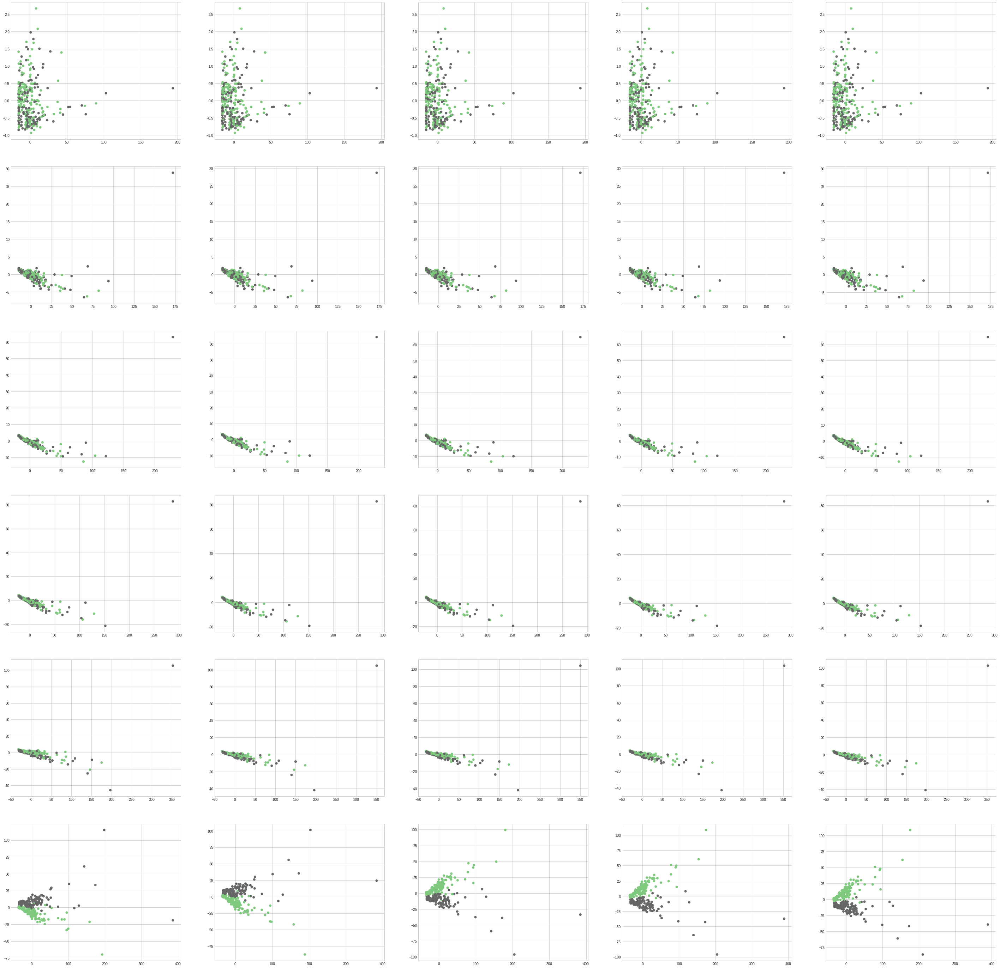

## Report

### Model & Data

**Model:** DistilBERT (https://huggingface.co/docs/transformers/model_doc/distilbert) 
**Data:**  IMDB-Dataset (https://huggingface.co/datasets/imdb) 

### Explainability Approaches
Find explainability approaches for the selected models. Repeat the section below for each approach to describe it.

#### Approach 1 : Showing how the attention changes when the model is trained

For our first approach, we use the library BertViz (https://github.com/jessevig/bertviz) to visualize the attention of the model for each layer and head. 
We use the model view of the library BertViz, which shows you can see the attention for every head for every layer at once. The visualization is interactive and you can see by clicking or hovering in the visualization to which words the attention flows.

Visualizing the attention of the DistilBERT trained on Imdb looks like the following:

With that we can learn about the model and how it works on attention level, but we wanted to apply this visualization to explain what the model has learned. So, we took the attention from a pretrained and untrained model on Imdb and visualize the difference between both attention matrices. Then we only see the attention connections, which got stronger by training the model on Imdb.

With that the following got visualized:

If we interact with the visualization, we can see what attention values got bigger, the following is an example:

We can see that in this example there is more attention for the words "highly" and "recommend" in layer 4 for head 5. This is something we would expect for a trained model on imdb.

The following is one example on a negative sentence:

Here we can see that the attention got stronger for words like "not", "really" and "good", which is also something we would expect.

This can help explain how the model is working and what it has learned to classify the sentences correctly in positive and negative. This could be helpful for more complex language classification tasks to see where the model puts its attention too to get to that classification. This helps us to understand the model and how it works and what it has learned better.

***

#### Approach 2 : Visualize the embeddings

In the second approach we created prediction of the IMDB dataset to calculate the shap values which give explaination how much a word contributed to the sentiment of a review.
Then we downproject the embedding of the words and color them according to their shap value.

The color of the words indicate wheter a word contributed more to positive or negative reviews. 
So it can be interpreted that certain words are more often used in a positive or negative way.
In the figure blue words represent positive sentiment, whereas red colored words represent negative words.
Black colored words are neutral.
The shading indicates how strong the sentiment of a word is. 

***

#### Approach 3 : Sentiment Analysis for every layer and epoch

We trained a pre-trained DistilBERT sentiment model for 5 epochs. After each epoch we generated embeddings for 200 samples and saved the hidden states of each layer for each sample in a numpy array of shape (epoch, sample, layer, hidden_dim). 
For each of the embeddings of the 5 epochs and the 6 layers we performed downprojection via PCA und visualized them in scatter plots, where the colors represent the labels, positive (1) and negative(0).

Here the downprojected embeddings are visualized. The rows of the visualization represent the epochs, the columns represent the layers. 
The plots illustrate well how the model learns sentiment analysis on the training samples by adapting the embeddings layer by layer, epoch by epoch.

***

#### Approach 4 : Sentiment Analysis with SHAP

Based on the work of Lundberg & Lee (https://proceedings.neurips.cc//paper/2017/file/8a20a8621978632d76c43dfd28b67767-Paper.pdf), the idea is to use the Shapely value that originally comes from game theory to determine the marginal contributions of input factors to the result. In our specific use case, this means that each DistilBERT token gets a certain Shapely value assigned, based on it’s impact on the prediction (positive or negative impact on sentiment). For this the SHAP library is used.

The results show which DistilBERT tokens have overall the biggest impact on positive or negative sentiment. This leads to a better understanding of how DistilBERT determines the overall sentiment of a sequence, focusing on Shapely-based feature importance. Not only can the importance be analyzed on a global level (e.g. obtaining the on average most influential tokens overall), but also on a sentence level. This means that we can determine which features are in general important for DistilBERT to decide if a sentiment is positive or negative, but also look at a specific sequence and get explanations for the related prediction.

The following two bar charts visualize the DistilBERT tokens that have the most impact on positive & on negative sentiment on a global level, sorted by their Shapely value. Interestingly, we can not only observe some general vocabulary that indicates strong sentiment ('dump' or 'benefits'), but also movie-related vocabulary ('loops', 'precursor').

The visualization below is an interactive tool provided by the SHAP library. It allows a text-level analysis of the DistilBERT token's impact on sentiment, based on it's Shapely value. In our sample text sequence we can see that tokens like 'good' or 'fantastic' are obviously strongly positively contributing to the sentiment of the text. What we should also note is that the somewhat negative sentiment in the 1st part of the 3rd sentence is not really captured. This could be an interesting observation for developers in order for them to understand better how the model works. 
Furthermore, we can see that the phrase got an overall Shapely value of ~1.54. This means that the general sentiment of the phrase is positive since the positive tokens overweigh the negative tokens (considering Shapely value).

***

### Summary of Approaches

Our goal was to get both a general understanding about the model, as well as task-specific insights which are in this case about Sentiment Analysis. Approaches 1 & 2 (Attention changes & Embedding visualisation) aim to target the former while approaches 3 & 4 (Sentiment per layer/epoch & SHAP) explain the latter. 

Furthermore, we believe that the mix of methods we used present a neat picture of Sentiment Analysis using DistilBERT. Not only do we cover details about the training process with approaches 1 & 3 (Attention changes & Sentiment per layer/epoch), we also show how the obtained results from DistilBERT can be used to explain feature importance and clusters in the embedding space with our approaches 2 & 4 (Embedding visualisation & SHAP). 
